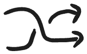

# Excalidraw Library Preview Generator

Generate high-quality PNG previews for all items in an Excalidraw library file using authentic Excalidraw rendering and fonts.

## 🚀 Quick Start

```bash
# Setup (downloads Puppeteer and Excalifont)
npm run setup

# Generate previews
npm run generate
```

## 📁 Output

- Creates `previews/` directory
- Generates `item-001.png`, `item-002.png`, etc.
- Uses authentic Excalidraw rendering with proper fonts
- White background with appropriate padding

## ✨ Features

- **Authentic rendering**: Uses official Excalidraw export functions
- **Proper fonts**: Loads Excalifont-Regular.woff2 (the current Excalidraw font)
- **High quality**: Full-resolution PNG output
- **Simple**: Single command, single approach
- **Robust**: Handles errors gracefully

## 🔧 How It Works

1. Launches headless Chrome via Puppeteer
2. Loads Excalidraw library in browser context
3. Embeds Excalifont-Regular.woff2 as base64
4. Uses `ExcalidrawLib.exportToCanvas()` for each item
5. Screenshots the resulting canvas

## 📋 Requirements

- Node.js
- Internet connection (for setup)

## 🐛 Troubleshooting

**Font issues**: The script automatically downloads the correct font. If you see Times New Roman, check that `fonts/Excalifont-Regular.woff2` exists.

**Setup fails**: Run setup manually:
```bash
npm install puppeteer
mkdir -p fonts
curl -L -o fonts/Excalifont-Regular.woff2 https://github.com/excalidraw/excalidraw/raw/master/public/Excalifont-Regular.woff2
```

**Browser issues**: The script uses `--no-sandbox` for compatibility. On some systems you may need additional Chrome dependencies.

## 🎯 Code Quality

- Single responsibility: does one thing well
- Clear error handling with helpful messages  
- No dead code or multiple approaches
- Uses official Excalidraw APIs
- Minimal dependencies

## 🖼️ Library Preview

| Item | Preview |
|------|---------|
| 001 |  |
| 002 |  |
| 003 |  |
| 004 |  |
| 005 |  |
| 006 |  |
| 007 |  |
| 008 |  |
| 009 |  |
| 010 |  |
| 011 |  |
| 012 |  |
| 013 |  |
| 014 |  |
| 015 |  |
| 016 |  |
| 017 |  |
| 018 |  |
| 019 |  |
| 020 |  |
| 021 |  |
| 022 |  |
| 023 |  |
| 024 |  |
| 025 |  |
| 026 |  |
| 027 |  |
| 028 |  |
| 029 |  |
| 030 |  |
| 031 |  |
| 032 |  |
| 033 |  |
| 034 |  |
