# Cary's Excalidraw Library

1. Download [the library file](carys-visual-vocabulary.excalidrawlib)
2. Drag and drop it into an Excalidraw canvas (or use the file browser inside the library palette)

## 🖼️ Library Preview

### Amperity Components

| Preview | Description |
| ------- | ----------- |
| 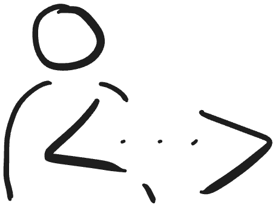 | Profile API |
| 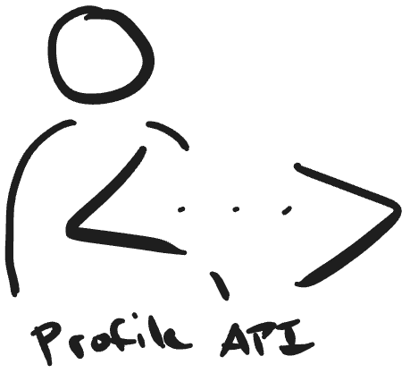 | Profile API (with name) |
|  | Durable IDs |
| 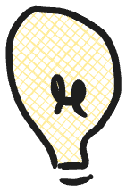 | Real-time tables |
|  | Profile store |
|  | Attribute library |

### Concepts

| Preview | Description |
| ------- | ----------- |
|  | Clipboard with checklist |
|  | Clipboard |
| 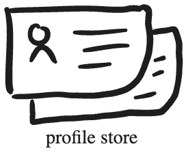 | Gears (processing) |
|  | Small gear |
| 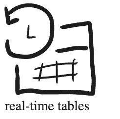 | Big gear |
| 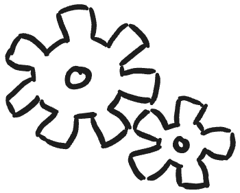 | Treasure map |
|  | Bug |
| 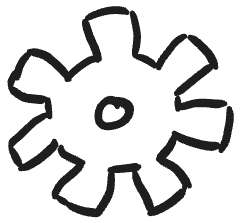 | Island destination |
| 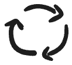 | Cycle |
| 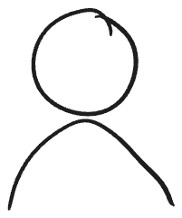 | Person |
| 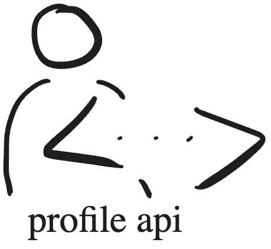 | Barricade (blocked/blockers) |
|  | Chatbot |
|  | Magnifying glass |
|  | Computer |
|  | Downspiral (bottomless pit, time sink) |
| 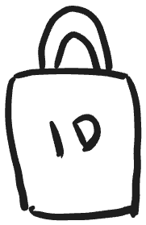 | Warning |
| 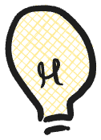 | Lightbulb 1 |
|  | Lightbulb 2 |
|  | Clock |
| 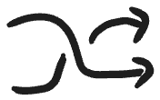 | Transform / redirect |
|  | People (users, group) |

### Logos

| Preview | Description |
| ------- | ----------- |
|  | Databricks |
| 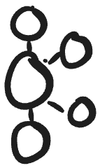 | Kafka |
|  | Jira |
