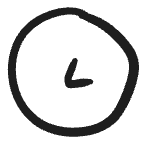

# Cary's Excalidraw Library

1. Download [the library file](carys-visual-vocabulary.excalidrawlib)
2. Drag and drop it into an Excalidraw canvas (or use the file browser inside the library palette)

## 🖼️ Library Preview

| Category | Icon | Preview |
| -------- | ---- | ------- |
| Amperity Component | Profile API |  |
| Amperity Component | Profile API (with name) |  |
| Amperity Component | Durable IDs |  |
| Amperity Component | Real-time tables |  |
| Amperity Component | Profile store |  |
| Amperity Component | Attribute library |  |
| Concepts | Clipboard with checklist |   |
| Concepts | Clipboard |  |
| Concepts | Gears (processing) |  |
| Concepts | Small gear |  |
| Concepts | Big gear |  |
| Concepts | Treasure map |  |
| Concepts | Bug |  |
| Concepts | Island destination |  |
| Concepts | Cycle |  |
| Concepts | Person |  |
| Concepts | Barricade (blocked/blockers) |  |
| Concepts | Chatbot |  |
| Concepts | Magnifying glass |  |
| Concepts | Computer |  |
| Concepts | Downspiral (bottomless pit, time sink) |  |
| Concepts | Warning |  |
| Concepts | Lightbulb 1 |  |
| Concepts | Lightbulb 2 |  |
| Concepts | Clock |  |
| Concepts | Transform / redirect |  |
| Concepts | People (users, group) |  |
| Logo | Databricks |  |
| Logo | Kafka |  |
| Logo | Jira |  |
